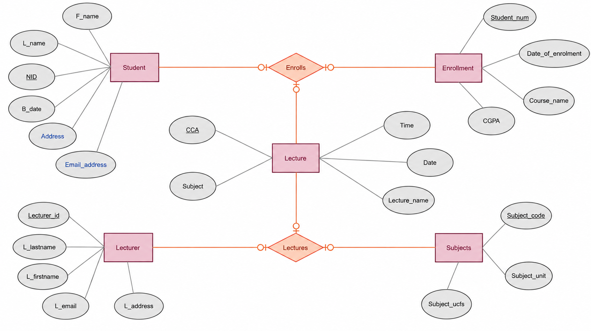

# ER Diagram Scenario and Relationships

### Scenario

This ER diagram represents a university student management system. It stores information about students, enrolments, lectures, lecturers, and subjects. Students have personal details such as their NID, first name, last name, date of birth, address, and email address. Students can enrol in courses, and the enrolment records contain information such as the student number, course name, date of enrolment, and CGPA.

The system also stores information about lecturers and subjects. Lecturers have details such as lecturer ID, name, email, and address. Lecturers give lectures for subjects, while subjects contain information such as subject code, subject unit, and subject UCFs.

### Additional Attributes

Two additional attributes can be added to the **Student** entity:

* **Address** – stores the student's address.
* **Email** – stores the student's email address.

### Relationships Between Entities

* **Student – Enrolls – Enrollment:** A student can have enrolment records for courses. This represents the relationship between students and their course enrolments.

* **Enrollment – Enrolls – Lecture:** An enrolment is associated with the relevant lecture information for the student's course.

* **Lecturer – Lectures – Subjects:** A lecturer teaches subjects. A lecturer can teach one or more subjects, and a subject can be taught by lecturers according to the university's teaching arrangement.

Overall, the ER diagram shows how student, enrolment, lecture, lecturer, and subject information is connected in a university database.
